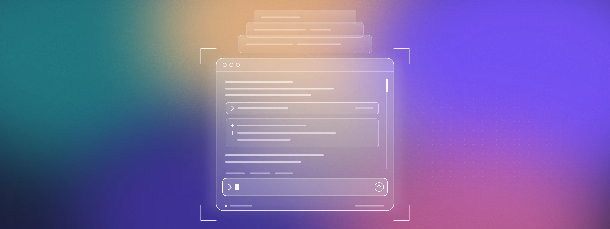

# Codex CLI goes fullscreen

<!-- COVER: set as the post's cover image in the CMS if it has a separate field; otherwise keep it here. -->

In *The 22 Immutable Laws of Marketing*, Al Ries and Jack Trout tell the story of a Listerine ad with an unlikely tagline: *"The taste you hate, twice a day."* It's their example of the Law of Candor. Admit a negative, and people will give you a positive. The ad worked because it said out loud what everyone already knew, and turned it into proof: if it tastes that strong, it must be doing something.

Codex CLI 0.157.0 changes how selecting and copying text works in your terminal, and you're going to notice. Most of us on the team did. It took a couple of days for the new muscle memory to set in.

We made the change for long sessions, which more and more people use Codex for. It also gives us room to build things a plain scrolling terminal never could.

<!-- VISUAL: Hero GIF (~10s). A long session in fullscreen: scroll far back through history, composer stays pinned at the bottom, then jump back to the latest message. -->

Codex CLI 0.157.0 is our largest update since launch. In the new fullscreen view, Codex takes over the whole terminal window, the same way `vim`, `top` or `lazygit` do. Codex now draws and manages the entire screen, including the transcript, the composer and the status line.

## Built for long sessions

When we first built Codex, managing context was a big part of working with the model. You'd often start fresh just to keep a session from getting polluted.

That's changed. Models have gotten really good at managing context, compaction is now rock solid, and with memory in the mix, long sessions no longer need babysitting. Codex has grown from short, focused exchanges into agents that run for long stretches.

The classic view wasn't built for that. It lived inside your terminal's scrollback, so it was bound by limits that vary from terminal to terminal. And because we never knew if or when you'd scroll back, we had to load as much of the conversation as we could up front. The longer the session, the more we loaded, and older history still fell off the top.

*Figure 1. The classic view loads the whole conversation up front and loses whatever falls past the scrollback limit. Fullscreen loads history as you scroll to it and keeps the composer in place.*

In fullscreen:

- Sessions open fast, however long they get. History loads as you scroll to it.
- Keep scrolling and Codex keeps loading, all the way back to the start of the session.
- Reread a plan or an earlier diff while the composer stays right where it is, ready for your next message.

The classic view could only append lines or redraw the whole screen, so streamed tables and lists had to repaint the entire scrollback as they grew. Thanks to Rust and some careful engineering you rarely felt it, but you could on slow terminals and high-latency SSH connections. Fullscreen redraws exactly what changed.

Parts of Codex, like the command center and the transcript, were already fullscreen. Now everything scrolls, selects and navigates the same way.

The layout has a few smaller changes:

*Figure 2. The parts of the fullscreen view.*

- **Hints and keyboard shortcuts** get a dedicated area, always just above the composer.
- **A dedicated status line** stays on screen, even when contextual notices appear.
- **Warnings** move out of the transcript into their own panel, so your conversation stays about your work.
- **Diffs and tool output collapse**, so those 400 lines of test results are there only when you want them.

## Copy and paste

In fullscreen, Codex handles text selection itself, and that changes a habit you probably use dozens of times a day.

<!-- VISUAL: Short GIF (~5s). Drag to select a code block in the transcript, "Copied" confirmation appears, paste into an editor or doc showing preserved formatting. -->

In Ghostty 1.2+, kitty on macOS, Windows Terminal and VS Code on Windows, your usual copy shortcut keeps working. Most other terminals, including Terminal.app and iTerm2, keep that shortcut for themselves. For those, Codex now copies the moment you finish selecting, so you don't need a shortcut.

*Figure 3. How copying works in each terminal, and how to change it.*

If you'd rather choose for yourself, set `copy_on_select` in the `[tui]` section of your config to `auto` (the default), `always` or `never`.

What you copy now pastes back cleanly. Codex puts both Markdown and formatted text on your clipboard, so you get the right one depending on where you paste. And if you ever need your terminal's own selection, hold <kbd>Shift</kbd>, <kbd>Fn</kbd> or <kbd>Alt</kbd>/<kbd>Opt</kbd> while you drag.

## Where this is going

With control of the whole screen, Codex can put things side by side, update them in place, and give each kind of information its own space. We're working on:

<!-- VISUAL: Early screenshot or mockup of /side running next to the main conversation, clearly labeled "preview". -->

- **`/side`.** Ask a quick question in a second conversation shown next to your main one, without derailing the task in progress.
- **A pane for your conversation.** If you've used the side panels in the Codex desktop app, imagine a version alongside the transcript with information about the current conversation.
- **Visualizations built for the terminal.** Richer ways to see what your agents are doing, designed for the TUI.

We'll share more as they land.

## Give it a fair try

Fullscreen changes habits you've built over years, and the first day can feel off. We'd like you to give it a few days before deciding.

If it still isn't for you, the classic scrollback view is one command away:

1. Run `/tui`.
2. Choose **Scrollback**.
3. Restart Codex.

Your choice is saved for future launches. To come back to fullscreen, run `/tui`, choose **Fullscreen**, and restart. If you manage your config by hand, the same switch is `fullscreen_transcript = false` under `[tui]`.

We're still smoothing out rough edges. Run `/feedback` and let us know what would make fullscreen work for you.
