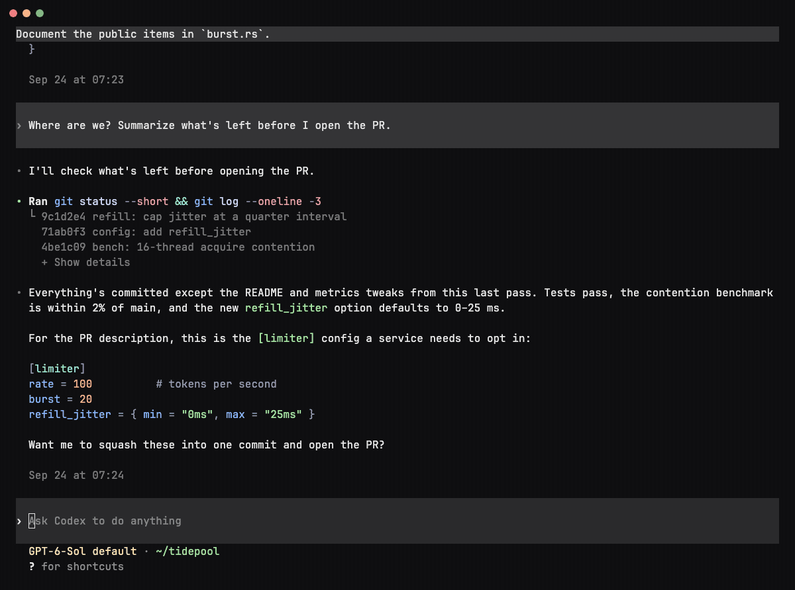
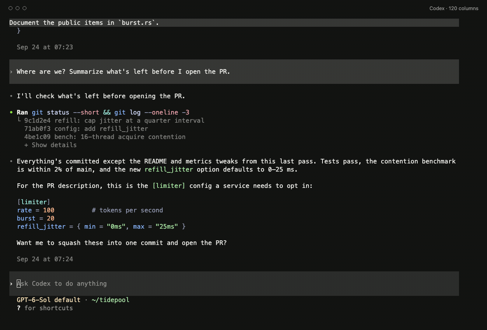
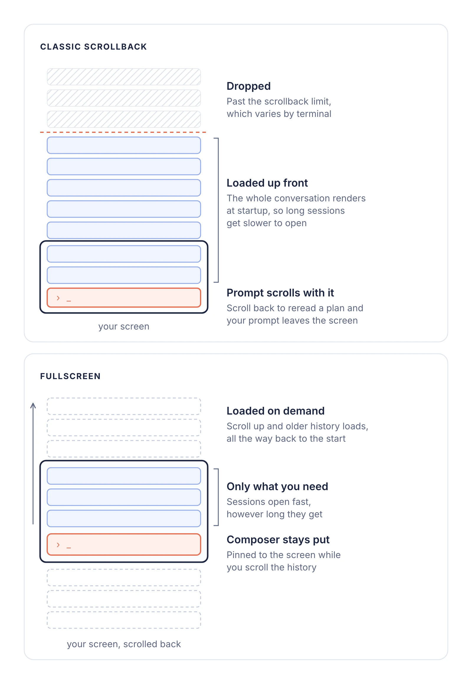
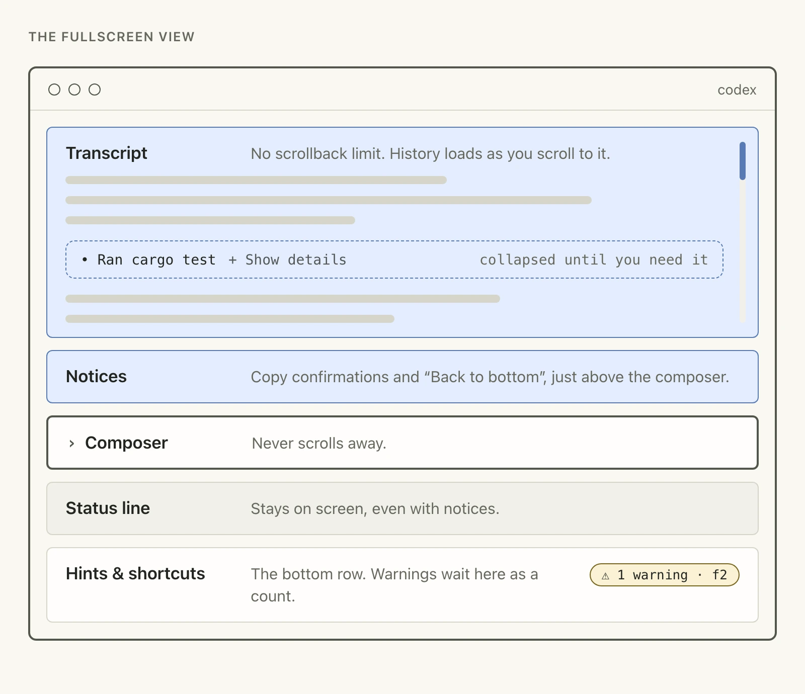
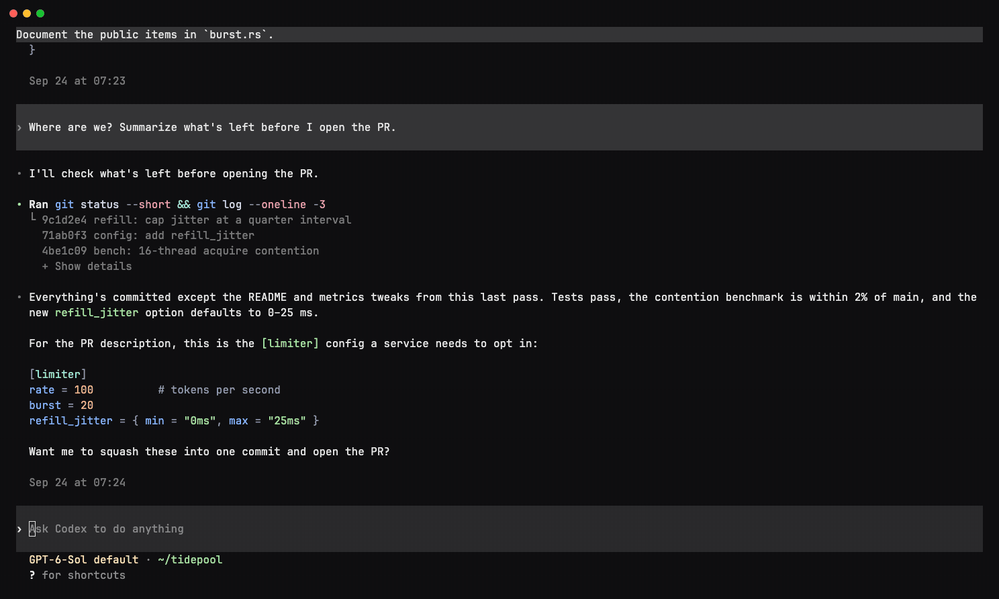

# Codex CLI goes fullscreen

In *The 22 Immutable Laws of Marketing*, Al Ries and Jack Trout describe an ad for Listerine built around a candid admission about its taste. The idea stuck with us while working on this update.

Fullscreen changes how selecting and copying text works in Codex CLI. Most of us on the team noticed the difference, and it took a couple of days for the new habit to settle in. Here's what changes, why we made it, and how to switch back if it doesn't work for you.

## What changes

Codex CLI 0.157.0 introduced a fullscreen view. Codex draws the transcript, composer and status line itself, in the same way that `vim`, `top` or `lazygit` own their terminal windows.

*Scrolling through a saved example session; the composer stays in place.*

When you scroll back, Codex loads earlier history as you reach it. The composer stays on screen, ready for your next message. Older messages no longer fall off the top because your terminal reached its scrollback limit.

## Selecting and copying

Codex handles selection in fullscreen. On terminals that forward the usual copy key to the app, select text and use that shortcut. In other terminals, Codex copies as soon as you finish selecting.

*Copy-on-select with prose and code in an example session.*

| Default behavior | Where |
| --- | --- |
| Use your usual copy shortcut | Ghostty 1.2+ when its version is detected, kitty on macOS, Windows Terminal (including WSL), and VS Code on Windows |
| Copies when you finish selecting | Terminal.app, iTerm2, other terminals and anything inside tmux or Zellij |

These are Codex's defaults for a directly detected terminal. Terminal versions, custom keybindings and remote sessions can affect what keys reach the app. If you prefer to choose, set `copy_on_select` under `[tui]` to `"auto"`, `"always"` or `"never"`.

When the selection includes prose, Codex offers Markdown and formatted text to the clipboard. A code-only selection copies as plain text. If you need the terminal's own selection, use your terminal's selection override; the modifier varies between terminals.

## Why long sessions needed this

When we first built Codex, managing context often meant starting fresh. Compaction and memory now make it easier to keep working in the same conversation, so the limits of terminal scrollback show up more often.

The classic view lived inside that scrollback. We couldn't know when you would scroll back, so we loaded as much conversation as we could up front. The longer the session, the more we loaded, and older history could still fall off the top.

*Figure 1. History belongs to the terminal in classic view and to Codex in fullscreen.*

Fullscreen loads history as you reach it, so opening a long session no longer means drawing the whole transcript into scrollback. It can also redraw just the parts of streaming output that changed. That helps with growing tables and lists, especially on slower terminals or high-latency connections.

*Figure 2. Notices appear above the composer. Status and shortcuts have their own rows.*

The status line stays on screen when notices appear. Hints and shortcuts move to their own row at the bottom. Warnings show as a count there; <kbd>F2</kbd> opens them. Diffs and tool output can collapse, keeping long test runs available without filling the conversation.

## What we're building next

Once Codex owns the screen, it can put information beside the conversation and update each area in place. One experiment is `/side`: a second conversation alongside the first.

*A development preview of /side, using an example conversation. The split requires at least 145 columns.*

On wide terminals, the work in progress can remain visible while you ask a separate question. The preview gives each conversation its own composer; click a pane or use <kbd>Ctrl</kbd>+<kbd>/</kbd> to switch focus. Narrow terminals fall back to a single conversation. This is still in development.

We're also exploring a conversation information pane and ways to show agent activity in the terminal. We'll share more when those are ready.

## Give it a try

Give fullscreen a few days if you can. If the change still doesn't suit how you work, the classic scrollback view is one command away:

1. Run `/tui`.
2. Choose **Scrollback**.
3. Restart Codex.

Codex remembers your choice. To return, run `/tui`, choose **Fullscreen**, and restart. The equivalent config setting is `fullscreen_transcript = false` under `[tui]`.

Run `/feedback` and let us know what would make fullscreen work for you.
